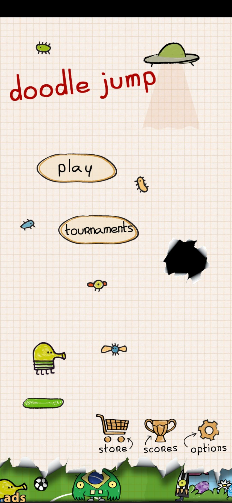
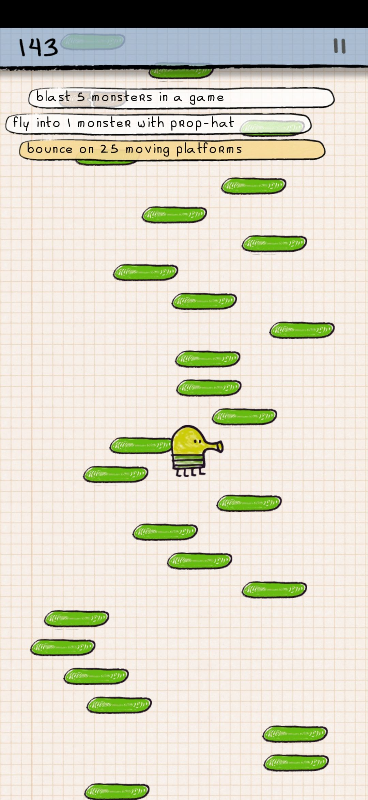
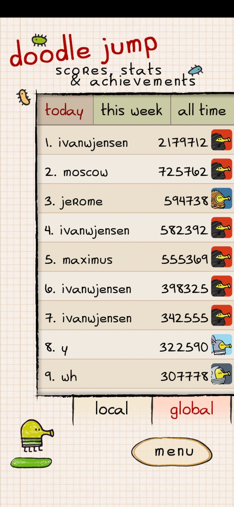

# doodle jump

## 게임 컨셉

캐릭터를 조작해 발판을 밟고 장애물을 피해 계속 올라가는 게임.

발판에서 떨어지거나 장애물에 충돌 할 경우 게임이 오버된다. 

자이로센서를 이용해, 기기를 기울이면서 조작한다. 

## 개발 범위

* 캐릭터
   * 자이로센서로 이동
   * 포탄 발사 
   * 동작 별 애니메이션
     * 사망 
     * 포탄 발사
     * 점프

* 맵(발판) (5종)
   * 일반형
   * 1회용
   * 시간제한
   * 이동형
   * 가짜

* 아이템 (4종) 
   * 로켓
   * 프로펠러 모자
   * 스프링
   * 방패

* 몬스터 (2종)
   * 부유형 (좌우 순찰)
   * 고정형

* 장애물 (2종)
   * 가시
   * 웜홀

## 예상 게임 실행 흐름

메인 메뉴, high score를 볼 수 있고 게임을 시작 할 수 있다.

게임 화면, 게임 오버 될 때 까지 게임을 플레이하고, 게임이 오버되면 high score 화면으로 넘어간다.

 

high score 화면, 고득점을 확인하고 게임을 다시 시작 할 수 있다.

## 개발 일정

* 1주

  게임 프레임워크 적용, 각 scene의 간략한 구현

* 2주

  리소스(캐릭터, 몬스터 장애물, 발판, 배경) 수집

* 3주

  메인 캐릭터, 터치로 조작(임시)구현

* 4주

  맵(발판), 카메라 구현

* 5주 

  장애물, 아이템 구현

* 6주

  high score, 메뉴, 일시정지 scene의 세부적인 사항 완성

* 7주

  자이로스코프 활용 조작 완성

* 8주

  테스트 하면서 미흡한 부분 보강
