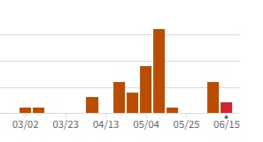

## 개발 범위

* 캐릭터
   * 자이로센서로 이동
   * 포탄 발사 
   * 동작 별 애니메이션
     * 사망 
     * 포탄 발사
     * 점프

* 맵(발판) (5종)
   * 일반형
   * 1회용
   * 시간제한
   * 이동형
   * 가짜

* 아이템 (4종) 
   * 로켓
   * 프로펠러 모자
   * 스프링
   * 방패

* 몬스터 (2종)
   * 부유형 (좌우 순찰)
   * 고정형

* 장애물 (2종)
   * 가시
   * 웜홀

## 예상 게임 실행 흐름

메인 메뉴, high score를 볼 수 있고 게임을 시작 할 수 있다.

게임 화면, 게임 오버 될 때 까지 게임을 플레이하고, 게임이 오버되면 high score 화면으로 넘어간다.

 

high score 화면, 고득점을 확인하고 게임을 다시 시작 할 수 있다.

## 개발 일정

* 1주 (완료)

  게임 프레임워크 적용, 각 scene의 간략한 구현

* 2주 (완료)

  리소스(캐릭터, 몬스터 장애물, 발판, 배경) 수집

* 3주 

  메인 캐릭터, 터치로 조작(임시)구현
  
  -> 캐릭터의 포탄발사, 애니메이션 구현 못함.

* 4주 

  맵(발판), 카메라 구현
  
  -> 발판 1종은 구현하지 못함.

* 5주 

  장애물, 아이템 구현

  ->장애물은 구현하지 못함.

* 6주  

  high score, 메뉴, 일시정지 scene의 세부적인 사항 완성

  ->일시정지 기능은 구현하지 못함.

* 7주 (완료)

  자이로스코프( = 가속도센서) 활용 조작 완성

* 8주 -

  테스트 하면서 미흡한 부분 보강

## 주차별 commits

* 1주차 3commits
* 2주차 -
* 3주차 5 commits
* 4주차 4 commits
* 5주차 16 commits
* 6주차 -
* 7주차 6 commits
* 8주차 2 commits

## MainScene 에 등장하는 game object들 설명

* 카메라와 배경

  카메라는 생성할 때 캐릭터를 인자로 받아서 캐릭터 중심으로 월드좌표를 변환한다. 
  배경은 월드좌표에서 y축으로 무한히 쌓되 실제로는 카메라에 들어오는 것들만 계산하여 최소한으로 렌더링한다.

* 발판

  발판 generator가 발판을 만들고, 발판들은 발판을 상속받아서 동작한다. 카메라 밑으로 떨어진 발판은 삭제되어 재사용된다.

* 아이템

  아이템은 발판 generator 가 발판을 만들때 확률적으로 생성되며 발판이 생성될때이 그 아이템을 인자로 받아서 아이템의 좌표를 관리하고 아이템은 자기 자신을 삭제하지 못하는 대신 발판이 아이템이 마킹되있는지 감시하여 마킹이 된 아이템을 삭제하도록 한다.

  
* 캐릭터

  일단은 터치로 동작하며 아이템과 충돌하면 아이템이 캐릭터 내부에 아이템구현 함수를 호출한다.
  발판과 충돌해도 발판과 상호작용한다.

## 스크린샷

## 사용된 기술
가속도센서

## 참고한 것들
수업 커밋내용 

가속도 센서(자이로센서)의 경우 검색을 통해서 많이 참고했다.

## 수업내용에서 차용한 것
대부분의 기능들

## 직접 개발한 것
월드좌표와 실제 보이는 뷰포트를 따로 만들어서 구현한 것들, 

카메라와 관련 된 것들
Sprite 클래스에 내 카메라 구현에 필요한 함수들을 많이 추가했다.

## 하고 싶었지만 못 한 것들
스테이트 머신, 

아이템에 의한 상태변화가 스테이트 머신이 필요 할 정도로 복잡할 것 같지 않아서 안 만들었는데 

하나씩 추가하다보니까 너무 누더기코드 처럼 더러워져서 처음부터 만들걸 그랬다.

아이템을 먹으면 아이템의 외형이 캐릭터에 추가로 붙는데, 이 코드가 상당히 지저분하다.

더 깔끔하게 설계할수 있을 것 같은데 방법을 모르겠다.

## (앱을 스토어에 판다면) 팔기 위해 보충할 것들
구현못한 기능들, (일시정지 같은..)

섬세한 난이도 조절 추가

## 결국 해결하지 못한 문제/버그
좌우반전과 회전, 

좌우반전 같은 경우srcRect의 값을 -1, 1과 같이 조금 바꾸면 되는데 잘 안됐음.

회전같은 경우로 회전하니까 프랙탈모양을 그리면서 기괴하게 회전해서 결국 해결 못했다.

카메라 클래스 설계를 잘못 한 것 같다. 각종 변환과 카메라와 엮여있어서 꼬여버린것 같다. 

## 이번 수업에서 기대한 것, 얻은 것, 얻지 못한 것
클래스 설계와 디자인 패턴에 대해서 조금 더 알게 된 것 같아서 좋다.

